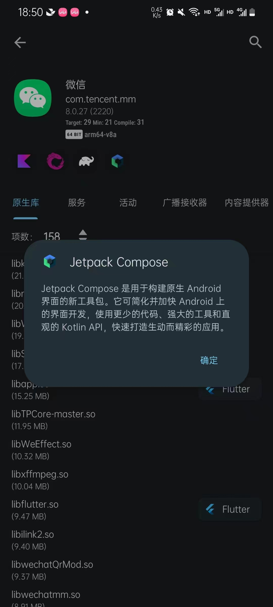

# MyCareer
My learning record for Android development.
  
---
  
## 数据结构
### 可感知组件生命周期的数据结构
#### Flow
> 流是冷的，只有在收集（如：collect方法）的时候才会接收值和执行上游流的操作（如果有的话，比如map等转换操作）  

* 流的收集
> 流的收集要确保在组件（Activity or Fragment）生命周期的活动状态内
* 在activity中收集
```Kotlin
class LatestNewsActivity : AppCompatActivity() {
    private val latestNewsViewModel = // getViewModel()

    override fun onCreate(savedInstanceState: Bundle?) {
        ...
        // Start a coroutine in the lifecycle scope
        lifecycleScope.launch {
            // repeatOnLifecycle launches the block in a new coroutine every time the
            // lifecycle is in the STARTED state (or above) and cancels it when it's STOPPED.
            repeatOnLifecycle(Lifecycle.State.STARTED) {
                // Trigger the flow and start listening for values.
                // Note that this happens when lifecycle is STARTED and stops
                // collecting when the lifecycle is STOPPED
                latestNewsViewModel.uiState.collect { uiState ->
                    // New value received
                    when (uiState) {
                        is LatestNewsUiState.Success -> showFavoriteNews(uiState.news)
                        is LatestNewsUiState.Error -> showError(uiState.exception)
                    }
                }
            }
        }
    }
}
```
* 在fragment中收集[[参考](https://developer.android.com/topic/libraries/architecture/coroutines)]
```Kotlin
class MyFragment : Fragment() {

    val viewModel: MyViewModel by viewModel()

    override fun onViewCreated(view: View, savedInstanceState: Bundle?) {
        super.onViewCreated(view, savedInstanceState)

        // Create a new coroutine in the lifecycleScope
        viewLifecycleOwner.lifecycleScope.launch {
            // repeatOnLifecycle launches the block in a new coroutine every time the
            // lifecycle is in the STARTED state (or above) and cancels it when it's STOPPED.
            viewLifecycleOwner.repeatOnLifecycle(Lifecycle.State.STARTED) {
                // Trigger the flow and start listening for values.
                // This happens when lifecycle is STARTED and stops
                // collecting when the lifecycle is STOPPED
                viewModel.someDataFlow.collect {
                    // Process item
                }
            }
        }
    }
}
```
> Cause:在fragment中是用viewLifecycleOwner创建可感知组件生命周期的收集作用域，而不是像Activity中那样用lifecycleScope直接创建（我们从上面的例子可以看到，activity是在oncreate中收集的，而fragment是在onViewCreated中收集的），这样的话，当fragment视图被销毁时，该协程作用域也会跟着view一起被取消。这样做的好处在于避免重复创建协程。比如，当我们旋转屏幕，或者我们使用navigation Component跳转到新的fragment页面再返回时，由于重新创建视图而导致的协程构建被再次执行，这样会导致一个收集器会同时收集到重复的一个事件。
>  
> 如果要使用lifecycleScope在fragment中创建协程作用域的话，可以在onCreate方法中使用，也能避免由于fragment生命周期的改变导致协程作用域被多次创建，但是不建议这么做。
>  
> 使用生命周期感知的协程收收集器，可以有效避免视图内存泄漏的问题。
##### StateFlow
> 需要设置一个初始值
>  
> 支持跟视图绑定，要记得给binding设置生命周期，否则当StateFlow值发生改变时，绑定到视图的值也不会改变
* 在activity中绑定
```Kotlin
class ViewModelActivity : AppCompatActivity() {
    override fun onCreate(savedInstanceState: Bundle?) {
        // Inflate view and obtain an instance of the binding class.
        val binding: UserBinding = DataBindingUtil.setContentView(this, R.layout.user)

        // Specify the current activity as the lifecycle owner.
        binding.lifecycleOwner = this
    }
}
```
* 在fragment中绑定
```Kotlin
binding.lifecycleOwner = viewLifecycleOwner
```
##### SharedFlow
> 没有初始值  

* 发送一个值
> 要在协程作用域中发送值
```Kotlin
private val _mValueFour = MutableSharedFlow<Int>(0)
val mValueFour: SharedFlow<Int> = _mValueFour
fun increaseFourValue() {
    Log.d("wyy", "increaseFourValue")
    viewModelScope.launch {
        _mValueFour.emit(1)
    }
}
```
* replay
> 缓存指定数量的数据，用于设置对新创建的收起器发送最多为指定数量的数据，改配置只会对新的收集器起作用。一般设置为0，不需要给新创建的收集器发送已经触发过的数据。如果需要发送最后一个数据给收集器的话，可以考虑使用StateFlow。

#### Channel
* 发送一个值
> 要在协程作用域中发送值,这一点，跟SharedFlow一样
```Kotlin
private val _mChannelValue = Channel<Int>()
val mChannelValue = _mChannelValue.receiveAsFlow()
fun increaseChannelValue() {
    viewModelScope.launch {
        _mChannelValue.send(1)
    }
}
```
> Note:将通道转为流使用  

#### LiveData
> 在Fragment中，当用户使用navigation组件导航到新的Fragment组件，然后再返回时，observe方法会再触发获取最新值的事件

#### 几个数据结构的比较
类型 | 再次返回Activity/fragment时，是否会再次触发数据采集
:---: | :---:
Flow | No
StateFlow | Yes
SharedFlow | No
LiveData | Yes
---  
### 泛型
> 协变和逆变应用的时候需要遵循 PECS（Producer-Extends, Consumer-Super）原则，即 ? extends 或者 out 作为生产者，? super 或者 in 作为消费者。遵循这个原则的好处是，可以在编译阶段保> 证代码安全，减少未知错误的发生。
#### Kotlin和Java中的协变和逆变  
泛化类型 | Kotlin | Java | 添加(写)数据 | 读取数据 | 用于定义类型的界限
:---: | :---: | :---: | :---: | :---: | :---:
协变 | out | ? extends | 否 | 是 | 下限
逆变 | in | ? super | 是 | 否 | 上限  
> 协变：对外提供数据  
> 逆变：写入数据，可用于定义方法的形参（调用方法时我们传的参数称为实参）  
  
#### ?号和星投影
> 作用：也许只是为了告诉读者，我这里并不是忘记了定义一个类型。  
* Kotlin中的通配符 * 等效于 out Any
* Java中的通配符 ? 等效于 ? extends Object
* Java中的通配符 ? 等效于Kotlin中的 *

#### 标记符的规范使用
标记符 | 应用场景
:--- | :---
T(Type) | 类
E(Element) | 集合元素
K(Key) | 键
V(Value) | 值  
---
## UI 
### 动画
#### Property Animation
* ValueAnimator
> 在监听动画的方法里修改对象属性，来达到动画的效果。  
* ObjectAnimator
> 继承自ValueAnimator，对对象的可set/get属性动画，用法更简单，不需要在监听器中更新对象属性。但是可以设置动画的监听器，监听动画完成等事件。监听动画完成，可以在动画完成后执行一些我们想要的操作。  

#### View Animation
> 有两大约束
* 只是修改视图的绘制，并不会修改视图的位置。尤其是只有点击初始位置才能接收到点击事件  
* 只能对View使用
---
### 图片选择器
#### 推荐使用的库
1. [__PictureSelector__](https://github.com/LuckSiege/PictureSelector)
---
### 字符串资源引用
* 省略号
> …
---
### View的监听
#### 监听View的大小变化
有以下两个实现方式：
* 监听View的addOnLayoutChangeListener方法  
* 重写View的onSizeChanged方法  
> 参考[stackoverflow](https://stackoverflow.com/questions/4174613/how-to-detect-a-layout-resize)
>
> 使用场景：比如微信的聊天窗口，当输入框因为内容增加导致高度上升，这时候就需要根据消息列表的显示数量来判断是否需要重新将消息列表滚动到底部，避免由于输入框增高导致消息列表组件高度变小，这样就导致看不到最新的消息内容了。
>
> 场景解决方案：当输入框的高度发生变化时，滚动消息列表到底部。  
---  
### RecyclerView
#### 常用的第三方库
- [_BaseRecyclerViewAdapterHelper_](https://github.com/CymChad/BaseRecyclerViewAdapterHelper)
> 注意：adapter支持item和item内子View的点击和长按事件，当在设置item内子View的点击事件时，如果我们还监听了item的长按事件，则长按item内的对应子View无法触发长按事件，应该同时也设置item内子View的长按事件。  
#### Adapter  
- [_当列表数据变化时，使用adapter更新列表界面_](https://stackoverflow.com/questions/31367599/how-to-update-recyclerview-adapter-data/48959184#48959184)

### 布局
#### 设置布局的方向
    layoutDirection  
> 默认是从左到右，也可以设置[从右到左](https://stackoverflow.com/questions/21613855/how-to-design-right-to-left-linear-layout)

---
## AS编译
### Kotlin
#### 添加编译期参数
作用：  
1. 解决代码警告的问题  

  
在应用的app.gradle->android中配置，如下所示：  
```Groovy
android {
    kotlinOptions {
        ...其他配置
        freeCompilerArgs += [
                "-Xopt-in=kotlin.RequiresOptIn",
        ]
    }
}
```  
> "-Xopt-in=kotlin.RequiresOptIn"在这里就是添加的编译期参数

### AS控制台输出乱码
[解决AS build控制台乱码问题 参考1](https://blog.csdn.net/yann02/article/details/115667092)
[解决AS build控制台乱码问题 参考2](https://blog.csdn.net/weixin_37826412/article/details/105555837)

## 音频和视频
### 录音
#### 使用的库
- [_Android-Wave-Recorder_](https://github.com/squti/Android-Wave-Recorder)
- [_ZlwAudioRecorder_](https://github.com/zhaolewei/ZlwAudioRecorder)
> 两个库都支持音量大小的回调，Android-Wave-Recorder库的waveRecorder.onAmplitudeListener用于接收音量的回调。Android-Wave-Recorder库的使用感觉更简单一些。

## 网络传输
### 文件下载
- [_FileDownloader_](https://github.com/lingochamp/FileDownloader)

## 开发工具
### AS
#### 下载
[__下载地址__](https://developer.android.com/studio/archive)

## 查看应用信息
### 使用LibChecker应用查看应用信息
> LibChecker可在酷安应用商城下载，效果如下所示：  
  
  


## How to write README
> README.md文件编写教程  
* [Github Codes教程（有中文版）](https://docs.github.com/en/get-started/writing-on-github/getting-started-with-writing-and-formatting-on-github/basic-writing-and-formatting-syntax#styling-text)  
* [推荐教程](https://github.com/xcmy/GitHub-Flavored-Markdown/blob/master/README.md)
* [案例](https://github.com/jwasham/coding-interview-university)
* [参考如何写项目包结构](https://github.com/square/radiography)
